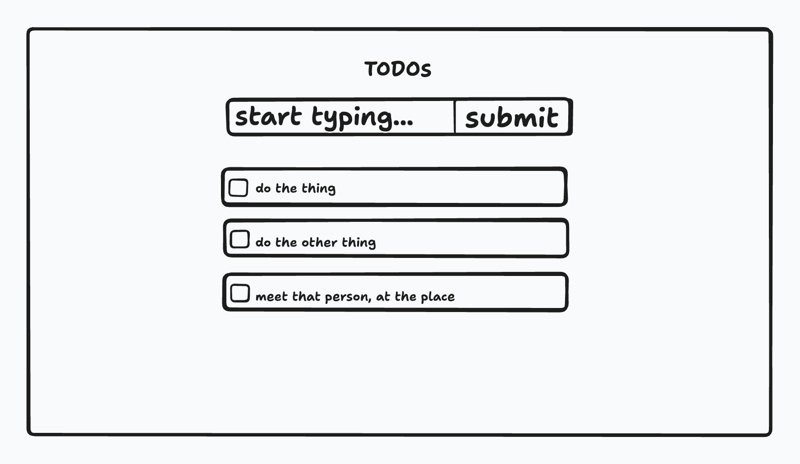

# Let's build a TODO app

In the end, let's have something that looks like this:

- You're free to use any CSS approach, whatever you're comfortable with (create-react-app ships with [CSS Modules](https://github.com/css-modules/css-modules) by default), such as [tailwind](https://tailwindcss.com/docs/guides/create-react-app) or [styled-components](https://styled-components.com/docs/basics#installation)
- Don't worry about using a backend, using state is enough for this exercise

## Create React App

This project was bootstrapped with [Create React App](https://github.com/facebook/create-react-app), and all the usual scripts are available:

### Available Scripts

In the project directory, you can run:

#### `npm start`

Runs the app in the development mode.\
Open [http://localhost:3000](http://localhost:3000) to view it in the browser.

The page will reload if you make edits.\
You will also see any lint errors in the console.

#### `npm test`

Launches the test runner in the interactive watch mode.\
See the section about [running tests](https://facebook.github.io/create-react-app/docs/running-tests) for more information.
